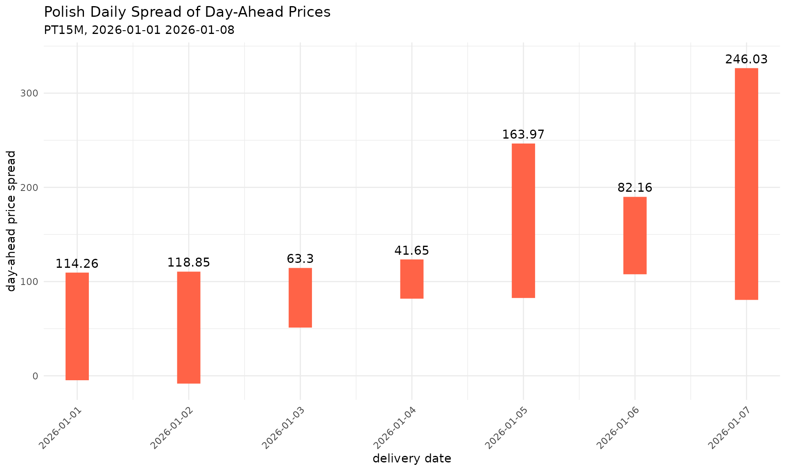

# Day-Ahead Price Spread Vignette

``` r
library(entsoeapi)
suppressPackageStartupMessages(library(dplyr))
suppressPackageStartupMessages(library(lubridate))
suppressPackageStartupMessages(library(kableExtra))
library(cli)
library(ggplot2)
```

### Look for the Polish market EIC and set the start and the end of scope dates

``` r
pl_eic <- all_approved_eic() |>
  filter(eic_long_name == "Poland") |>
  pull(eic_code)
#> 
#> ── public download ─────────────────────────────────────────────────────────────────────────────────────────────────────
#> ℹ downloading X_eicCodes.csv file ...
#> 
#> ── public download ─────────────────────────────────────────────────────────────────────────────────────────────────────
#> ℹ downloading Y_eicCodes.csv file ...
#> 
#> ── public download ─────────────────────────────────────────────────────────────────────────────────────────────────────
#> ℹ downloading Z_eicCodes.csv file ...
#> 
#> ── public download ─────────────────────────────────────────────────────────────────────────────────────────────────────
#> ℹ downloading T_eicCodes.csv file ...
#> 
#> ── public download ─────────────────────────────────────────────────────────────────────────────────────────────────────
#> ℹ downloading V_eicCodes.csv file ...
#> 
#> ── public download ─────────────────────────────────────────────────────────────────────────────────────────────────────
#> ℹ downloading W_eicCodes.csv file ...
#> 
#> ── public download ─────────────────────────────────────────────────────────────────────────────────────────────────────
#> ℹ downloading A_eicCodes.csv file ...

from_ts <- ymd(x = "2026-01-01", tz = "CET")
till_ts <- from_ts + weeks(x = 1L)

cli_inform("Polish EIC: '{pl_eic}'")
#> Polish EIC: '10YPL-AREA-----S'
cli_inform("from: {from_ts}")
#> from: 2026-01-01
cli_inform("till: {till_ts}")
#> till: 2026-01-08
```

### Query the Polish DA prices within the pre-set period

``` r
da_prices <- energy_prices(
  eic = pl_eic,
  period_start = from_ts,
  period_end = till_ts,
  contract_type = "A01",
  tidy_output = TRUE
)
#> 
#> ── API call ────────────────────────────────────────────────────────────────────────────────────────────────────────────
#> → https://web-api.tp.entsoe.eu/api?documentType=A44&in_Domain=10YPL-AREA-----S&out_Domain=10YPL-AREA-----S&periodStart=202512312300&periodEnd=202601072300&contract_MarketAgreement.type=A01&securityToken=<...>
#> <- HTTP/2 200 
#> <- date: Mon, 13 Apr 2026 08:53:01 GMT
#> <- content-type: text/xml
#> <- content-disposition: inline; filename="Energy_Prices_202512312300-202601072300.xml"
#> <- x-content-type-options: nosniff
#> <- x-xss-protection: 0
#> <- vary: accept-encoding
#> <- content-encoding: gzip
#> <- strict-transport-security: max-age=15724800; includeSubDomains
#> <-
#> ✔ response has arrived
#> ✔ Additional type names have been added!
#> 
#> ── public download ─────────────────────────────────────────────────────────────────────────────────────────────────────
#> ℹ pulling Y_eicCodes.csv file from cache
#> ✔ Additional eic names have been added!
glimpse(da_prices)
#> Rows: 672
#> Columns: 22
#> $ ts_in_domain_mrid          <chr> "10YPL-AREA-----S", "10YPL-AREA-----S", "10YPL-AREA-----S", "10YPL-AREA-----S", "10…
#> $ ts_in_domain_name          <chr> "Poland", "Poland", "Poland", "Poland", "Poland", "Poland", "Poland", "Poland", "Po…
#> $ ts_out_domain_mrid         <chr> "10YPL-AREA-----S", "10YPL-AREA-----S", "10YPL-AREA-----S", "10YPL-AREA-----S", "10…
#> $ ts_out_domain_name         <chr> "Poland", "Poland", "Poland", "Poland", "Poland", "Poland", "Poland", "Poland", "Po…
#> $ type                       <chr> "A44", "A44", "A44", "A44", "A44", "A44", "A44", "A44", "A44", "A44", "A44", "A44",…
#> $ type_def                   <chr> "Price Document", "Price Document", "Price Document", "Price Document", "Price Docu…
#> $ market_agreement_type      <chr> "A01", "A01", "A01", "A01", "A01", "A01", "A01", "A01", "A01", "A01", "A01", "A01",…
#> $ market_agreement_type_def  <chr> "Daily contract", "Daily contract", "Daily contract", "Daily contract", "Daily cont…
#> $ ts_auction_type            <chr> "A01", "A01", "A01", "A01", "A01", "A01", "A01", "A01", "A01", "A01", "A01", "A01",…
#> $ ts_auction_type_def        <chr> "Implicit", "Implicit", "Implicit", "Implicit", "Implicit", "Implicit", "Implicit",…
#> $ ts_business_type           <chr> "A62", "A62", "A62", "A62", "A62", "A62", "A62", "A62", "A62", "A62", "A62", "A62",…
#> $ ts_business_type_def       <chr> "Spot price", "Spot price", "Spot price", "Spot price", "Spot price", "Spot price",…
#> $ created_date_time          <dttm> 2026-04-13 08:53:01, 2026-04-13 08:53:01, 2026-04-13 08:53:01, 2026-04-13 08:53:01…
#> $ revision_number            <dbl> 1, 1, 1, 1, 1, 1, 1, 1, 1, 1, 1, 1, 1, 1, 1, 1, 1, 1, 1, 1, 1, 1, 1, 1, 1, 1, 1, 1,…
#> $ ts_resolution              <chr> "PT15M", "PT15M", "PT15M", "PT15M", "PT15M", "PT15M", "PT15M", "PT15M", "PT15M", "P…
#> $ ts_time_interval_start     <dttm> 2025-12-31 23:00:00, 2025-12-31 23:00:00, 2025-12-31 23:00:00, 2025-12-31 23:00:00…
#> $ ts_time_interval_end       <dttm> 2026-01-01 23:00:00, 2026-01-01 23:00:00, 2026-01-01 23:00:00, 2026-01-01 23:00:00…
#> $ ts_mrid                    <dbl> 1, 1, 1, 1, 1, 1, 1, 1, 1, 1, 1, 1, 1, 1, 1, 1, 1, 1, 1, 1, 1, 1, 1, 1, 1, 1, 1, 1,…
#> $ ts_point_dt_start          <dttm> 2025-12-31 23:00:00, 2025-12-31 23:15:00, 2025-12-31 23:30:00, 2025-12-31 23:45:00…
#> $ ts_point_price_amount      <dbl> 109.53, 107.86, 101.61, 80.43, 107.86, 96.77, 75.70, 64.00, 80.43, 82.78, 85.63, 98…
#> $ ts_currency_unit_name      <chr> "EUR", "EUR", "EUR", "EUR", "EUR", "EUR", "EUR", "EUR", "EUR", "EUR", "EUR", "EUR",…
#> $ ts_price_measure_unit_name <chr> "MWH", "MWH", "MWH", "MWH", "MWH", "MWH", "MWH", "MWH", "MWH", "MWH", "MWH", "MWH",…
```

### Calculate the daily minimum and maximum prices and the spread

``` r
da_spreads <- da_prices |>
  mutate(
    ts_point_dt_start = with_tz(time = ts_point_dt_start, tzone = "CET")
  ) |>
  mutate(
    ts_point_date = as.Date(x = ts_point_dt_start, tz = "CET")
  ) |>
  summarise(
    min_price = min(ts_point_price_amount, na.rm = TRUE),
    max_price = max(ts_point_price_amount, na.rm = TRUE),
    .by = ts_point_date
  ) |>
  mutate(price_spread = max_price - min_price)

da_spreads |>
  kbl(format = "pipe") |>
  cat(sep = "\n")
#> |ts_point_date | min_price| max_price| price_spread|
#> |:-------------|---------:|---------:|------------:|
#> |2026-01-01    |     -4.73|    109.53|       114.26|
#> |2026-01-02    |     -8.31|    110.54|       118.85|
#> |2026-01-03    |     51.15|    114.45|        63.30|
#> |2026-01-04    |     81.85|    123.50|        41.65|
#> |2026-01-05    |     82.58|    246.55|       163.97|
#> |2026-01-06    |    107.75|    189.91|        82.16|
#> |2026-01-07    |     80.55|    326.58|       246.03|
```

### Plot the daily minimum and maximum prices and the spread

``` r
print(
  ggplot(data = da_spreads) +
    geom_segment(
      mapping = aes(
        x = ts_point_date,
        xend = ts_point_date,
        y = min_price,
        yend = max_price
      ),
      linewidth = 10,
      color = "tomato"
    ) +
    geom_text(
      mapping = aes(
        x = ts_point_date,
        y = max_price + 10,
        label = price_spread
      ),
      size = 4
    ) +
    scale_x_date(
      breaks = da_spreads$ts_point_date,
      date_labels = "%Y-%m-%d"
    ) +
    theme_minimal() +
    labs(
      title = "Polish Daily Spread of Day-Ahead Prices",
      subtitle = paste("PT15M,", from_ts, till_ts),
      x = "delivery date",
      y = "day-ahead price spread"
    ) +
    theme(
      axis.text.x = element_text(angle = 45, hjust = 1)
    )
)
```


