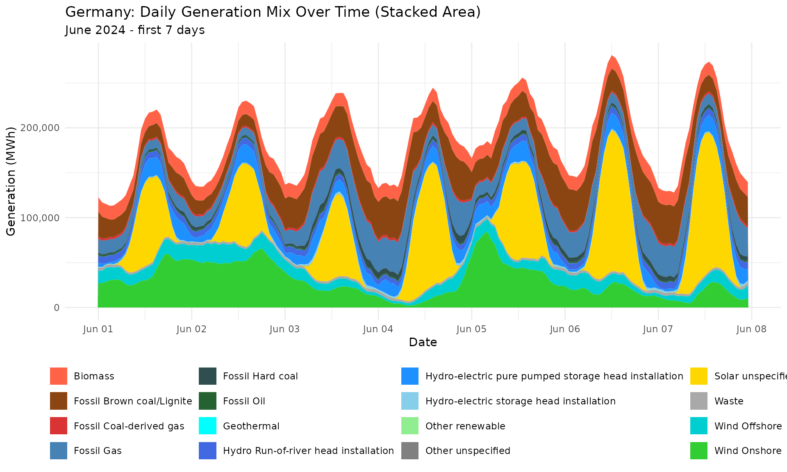
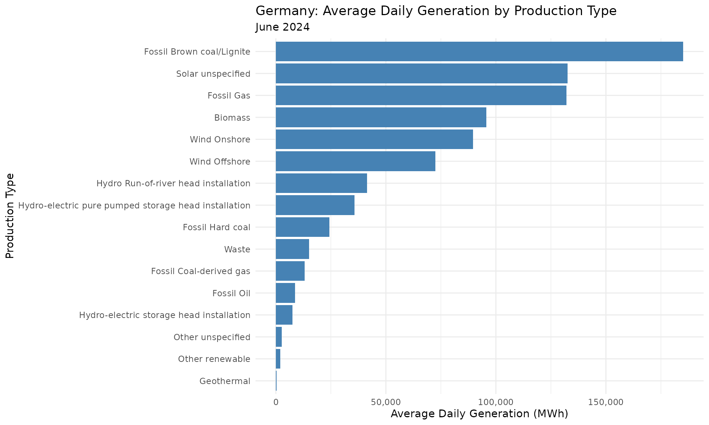
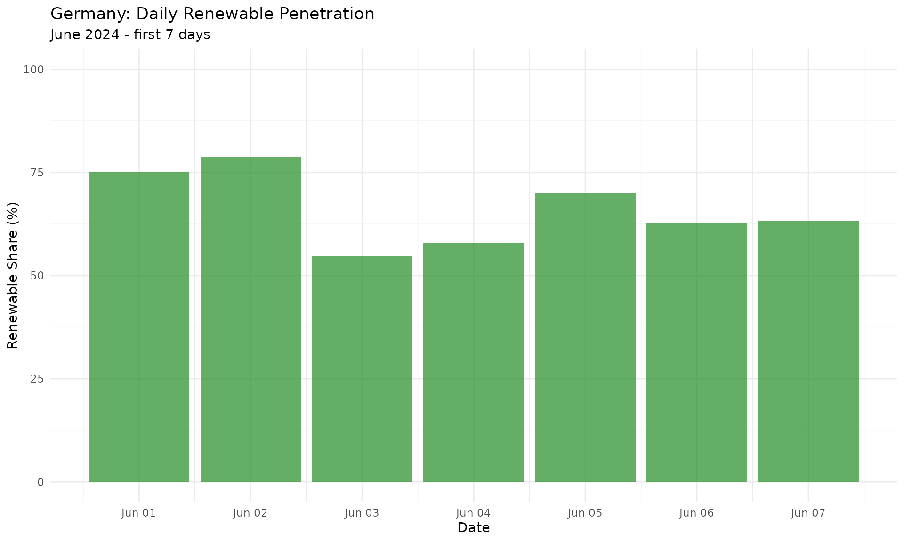
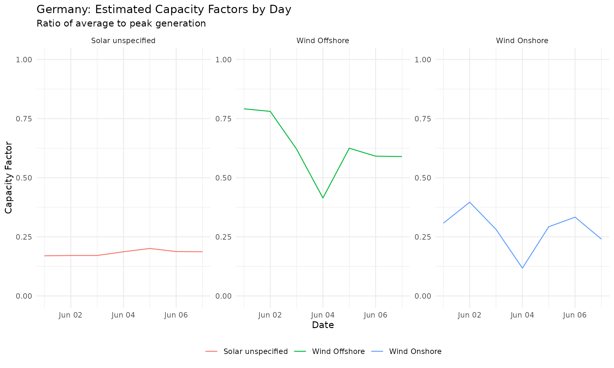
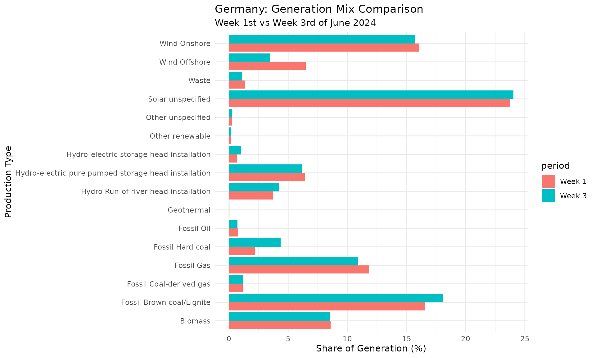

# Generation Mix Analysis

``` r
library(entsoeapi)
suppressPackageStartupMessages(library(dplyr))
suppressPackageStartupMessages(library(lubridate))
library(cli)
suppressPackageStartupMessages(library(kableExtra))
library(ggplot2)
```

## Introduction

This vignette demonstrates how to analyze electricity generation mix
data using the entsoeapi package. We’ll fetch generation by production
type for Germany and create visualizations to understand the composition
of the power supply.

This vignette covers:

- Fetching generation data by production type
- Understanding production type codes
- Visualizing the generation mix over time
- Calculating renewable penetration
- Comparing different time periods

## Generation Data Overview

The entsoeapi package provides several functions for generation data:

| Function                                                                                                          | Description                   | Typical Use            |
|-------------------------------------------------------------------------------------------------------------------|-------------------------------|------------------------|
| [`gen_per_prod_type()`](https://krose.github.io/entsoeapi/reference/gen_per_prod_type.md)                         | Generation by production type | Main analysis function |
| [`gen_installed_capacity_per_pt()`](https://krose.github.io/entsoeapi/reference/gen_installed_capacity_per_pt.md) | Installed capacity by type    | Capacity analysis      |
| [`gen_installed_capacity_per_pu()`](https://krose.github.io/entsoeapi/reference/gen_installed_capacity_per_pu.md) | Capacity per production unit  | Detailed analysis      |
| [`gen_per_gen_unit()`](https://krose.github.io/entsoeapi/reference/gen_per_gen_unit.md)                           | Generation per unit           | Unit-level data        |
| [`gen_day_ahead_forecast()`](https://krose.github.io/entsoeapi/reference/gen_day_ahead_forecast.md)               | Day-ahead forecasts           | Forecasting            |
| [`gen_wind_solar_forecasts()`](https://krose.github.io/entsoeapi/reference/gen_wind_solar_forecasts.md)           | Wind/solar forecasts          | Renewable forecasting  |
| [`gen_storage_mean_filling_rate()`](https://krose.github.io/entsoeapi/reference/gen_storage_mean_filling_rate.md) | Storage filling rates         | Storage analysis       |

## Fetching Generation Data

### Finding Germany’s EIC Code

First, let’s get Germany’s bidding zone EIC code:

``` r
# Germany's bidding zone EIC
de_zone <- area_eic() |>
  filter(eic_long_name == "Germany") |>
  pull(eic_code)
#> 
#> ── public download ─────────────────────────────────────────────────────────────────────────────────────────────────────
#> ℹ downloading Y_eicCodes.csv file ...

cli_h1("Germany Bidding Zone")
#> 
#> ── Germany Bidding Zone ────────────────────────────────────────────────────────────────────────────────────────────────
cli_text("EIC: {de_zone}")
#> EIC: 10Y1001A1001A83F
```

### Production Type Codes

ENTSO-E uses standard production type codes:

``` r
asset_types |>
  filter(startsWith(x = code, prefix = "B")) |>
  select(c(code, title)) |>
  kbl(format = "pipe") |>
  cat(sep = "\n")
#> |code |title                                                          |
#> |:----|:--------------------------------------------------------------|
#> |B01  |Biomass                                                        |
#> |B02  |Fossil Brown coal/Lignite                                      |
#> |B03  |Fossil Coal-derived gas                                        |
#> |B04  |Fossil Gas                                                     |
#> |B05  |Fossil Hard coal                                               |
#> |B06  |Fossil Oil                                                     |
#> |B07  |Fossil Oil shale                                               |
#> |B08  |Fossil Peat                                                    |
#> |B09  |Geothermal                                                     |
#> |B10  |Hydro-electric pure pumped storage head installation           |
#> |B11  |Hydro Run-of-river head installation                           |
#> |B12  |Hydro-electric storage head installation                       |
#> |B13  |Marine unspecified                                             |
#> |B14  |Nuclear unspecified                                            |
#> |B15  |Other renewable                                                |
#> |B16  |Solar unspecified                                              |
#> |B17  |Waste                                                          |
#> |B18  |Wind Offshore                                                  |
#> |B19  |Wind Onshore                                                   |
#> |B20  |Other unspecified                                              |
#> |B21  |AC Link                                                        |
#> |B22  |DC Link                                                        |
#> |B23  |Substation                                                     |
#> |B24  |Transformer                                                    |
#> |B25  |Energy storage                                                 |
#> |B26  |Demand Side Response                                           |
#> |B27  |Dispatchable hydro resource                                    |
#> |B28  |Solar photovoltaic                                             |
#> |B29  |Solar concentration                                            |
#> |B30  |Wind unspecified                                               |
#> |B31  |Hydro-electric unspecified                                     |
#> |B32  |Hydro-electric mixed pumped storage head installation          |
#> |B33  |Marine tidal                                                   |
#> |B34  |Marine wave                                                    |
#> |B35  |Marine currents                                                |
#> |B36  |Marine pressure                                                |
#> |B37  |Thermal unspecified                                            |
#> |B38  |Thermal combined cycle gas turbine with heat recovery          |
#> |B39  |Thermal steam turbine with back-pressure turbine (open cycle)  |
#> |B40  |Thermal steam turbine with condensation turbine (closed cycle) |
#> |B41  |Thermal gas turbine with heat recovery                         |
#> |B42  |Thermal internal combustion engine                             |
#> |B43  |Thermal micro-turbine                                          |
#> |B44  |Thermal Stirling engine                                        |
#> |B45  |Thermal fuel cell                                              |
#> |B46  |Thermal steam engine                                           |
#> |B47  |Thermal organic Rankine cycle                                  |
#> |B48  |Thermal gas turbine without heat recovery                      |
#> |B49  |Nuclear heavy water reactor                                    |
#> |B50  |Nuclear light water reactor                                    |
#> |B51  |Nuclear breeder                                                |
#> |B52  |Nuclear graphite reactor                                       |
#> |B53  |Temporary energy storage                                       |
#> |B54  |Permanent energy storage                                       |
#> |B55  |Electric vehicle battery                                       |
#> |B56  |Heat pump specified                                            |
#> |B57  |Heat pump electrical                                           |
#> |B58  |Heat pump absorption                                           |
#> |B59  |Auxiliary power unit                                           |
#> |B60  |Water electrolysis unspecified                                 |
#> |B61  |Water electrolysis low temperature unspecified                 |
#> |B62  |Water electrolysis low temperature main product                |
#> |B63  |Water electrolysis high temperature unspecified                |
#> |B64  |Steam methane reforming unspecified                            |
#> |B65  |Steam methane reforming without CCS/CCU  unspecified           |
#> |B66  |Steam methane reforming with CCS/CCU  unspecified              |
#> |B67  |Steam methane reforming with CCS/CCU  main product             |
#> |B68  |Partial oxidation unspecified                                  |
#> |B69  |Autothermal reforming unspecified                              |
#> |B70  |Methanol reforming unspecified                                 |
#> |B71  |Ammonia reforming unspecified                                  |
#> |B72  |Ammonia gasification                                           |
#> |B73  |Chlor-alkali electrolysis unspecified                          |
#> |B74  |Chlor-alkali electrolysis by-product                           |
#> |B75  |ACDC converter                                                 |
#> |B76  |Converter                                                      |
```

### Fetching Generation by Production Type

Use
[`gen_per_prod_type()`](https://krose.github.io/entsoeapi/reference/gen_per_prod_type.md)
to get generation data:

``` r
cli_h1("Fetching Generation Data")
#> 
#> ── Fetching Generation Data ────────────────────────────────────────────────────────────────────────────────────────────

# Define time range
from_ts <- ymd(x = "2024-06-01", tz = "CET")
till_ts <- from_ts + days(7)

cli_inform("Period: {from_ts} to {till_ts}")
#> Period: 2024-06-01 to 2024-06-08

# Fetch generation by production type
de_generation <- gen_per_prod_type(
  eic = de_zone,
  period_start = from_ts,
  period_end = till_ts,
  tidy_output = TRUE
)
#> 
#> ── API call ────────────────────────────────────────────────────────────────────────────────────────────────────────────
#> → https://web-api.tp.entsoe.eu/api?documentType=A75&processType=A16&in_Domain=10Y1001A1001A83F&periodStart=202405312200&periodEnd=202406072200&securityToken=<...>
#> <- HTTP/2 200 
#> <- date: Tue, 31 Mar 2026 07:10:11 GMT
#> <- content-type: text/xml
#> <- content-disposition: inline; filename="Aggregated Generation per Type_202405312200-202406072200.xml"
#> <- x-content-type-options: nosniff
#> <- x-xss-protection: 0
#> <- vary: accept-encoding
#> <- content-encoding: gzip
#> <- strict-transport-security: max-age=15724800; includeSubDomains
#> <-
#> ✔ response has arrived
#> ✔ Additional type names have been added!
#> 
#> ── public download ─────────────────────────────────────────────────────────────────────────────────────────────────────
#> ℹ pulling Y_eicCodes.csv file from cache
#> ✔ Additional eic names have been added!
#> ✔ Additional definitions have been added!

cli_alert_success("Retrieved {nrow(de_generation)} data points")
#> ✔ Retrieved 12768 data points
```

## Exploring the Data

### Understanding Output Columns

The output includes many columns with production type information:

``` r
glimpse(de_generation)
#> Rows: 12,768
#> Columns: 25
#> $ ts_in_bidding_zone_domain_mrid  <chr> NA, NA, NA, NA, NA, NA, NA, NA, NA, NA, NA, NA, NA, NA, NA, NA, NA, NA, NA, NA…
#> $ ts_in_bidding_zone_domain_name  <chr> NA, NA, NA, NA, NA, NA, NA, NA, NA, NA, NA, NA, NA, NA, NA, NA, NA, NA, NA, NA…
#> $ ts_out_bidding_zone_domain_mrid <chr> "10Y1001A1001A83F", "10Y1001A1001A83F", "10Y1001A1001A83F", "10Y1001A1001A83F"…
#> $ ts_out_bidding_zone_domain_name <chr> "Germany", "Germany", "Germany", "Germany", "Germany", "Germany", "Germany", "…
#> $ type                            <chr> "A75", "A75", "A75", "A75", "A75", "A75", "A75", "A75", "A75", "A75", "A75", "…
#> $ type_def                        <chr> "Actual generation per type", "Actual generation per type", "Actual generation…
#> $ process_type                    <chr> "A16", "A16", "A16", "A16", "A16", "A16", "A16", "A16", "A16", "A16", "A16", "…
#> $ process_type_def                <chr> "Realised", "Realised", "Realised", "Realised", "Realised", "Realised", "Reali…
#> $ ts_object_aggregation           <chr> "A08", "A08", "A08", "A08", "A08", "A08", "A08", "A08", "A08", "A08", "A08", "…
#> $ ts_object_aggregation_def       <chr> "Resource type", "Resource type", "Resource type", "Resource type", "Resource …
#> $ ts_business_type                <chr> "A01", "A01", "A01", "A01", "A01", "A01", "A01", "A01", "A01", "A01", "A01", "…
#> $ ts_business_type_def            <chr> "Production", "Production", "Production", "Production", "Production", "Product…
#> $ ts_mkt_psr_type                 <chr> "B10", "B10", "B10", "B10", "B10", "B10", "B10", "B10", "B10", "B10", "B10", "…
#> $ ts_mkt_psr_type_def             <chr> "Hydro-electric pure pumped storage head installation", "Hydro-electric pure p…
#> $ created_date_time               <dttm> 2026-03-31 07:10:10, 2026-03-31 07:10:10, 2026-03-31 07:10:10, 2026-03-31 07:…
#> $ revision_number                 <dbl> 1, 1, 1, 1, 1, 1, 1, 1, 1, 1, 1, 1, 1, 1, 1, 1, 1, 1, 1, 1, 1, 1, 1, 1, 1, 1, …
#> $ time_period_time_interval_start <dttm> 2024-05-31 22:00:00, 2024-05-31 22:00:00, 2024-05-31 22:00:00, 2024-05-31 22:…
#> $ time_period_time_interval_end   <dttm> 2024-06-07 22:00:00, 2024-06-07 22:00:00, 2024-06-07 22:00:00, 2024-06-07 22:…
#> $ ts_resolution                   <chr> "PT15M", "PT15M", "PT15M", "PT15M", "PT15M", "PT15M", "PT15M", "PT15M", "PT15M…
#> $ ts_time_interval_start          <dttm> 2024-05-31 22:00:00, 2024-05-31 22:00:00, 2024-05-31 22:00:00, 2024-05-31 22:…
#> $ ts_time_interval_end            <dttm> 2024-06-07 22:00:00, 2024-06-07 22:00:00, 2024-06-07 22:00:00, 2024-06-07 22:…
#> $ ts_mrid                         <dbl> 1, 1, 1, 1, 1, 1, 1, 1, 1, 1, 1, 1, 1, 1, 1, 1, 1, 1, 1, 1, 1, 1, 1, 1, 1, 1, …
#> $ ts_point_dt_start               <dttm> 2024-05-31 22:00:00, 2024-05-31 22:15:00, 2024-05-31 22:30:00, 2024-05-31 22:…
#> $ ts_point_quantity               <dbl> 32.54, 20.25, 24.45, 76.68, 24.80, 36.64, 46.20, 57.35, 56.62, 130.36, 141.57,…
#> $ ts_quantity_measure_unit_name   <chr> "MAW", "MAW", "MAW", "MAW", "MAW", "MAW", "MAW", "MAW", "MAW", "MAW", "MAW", "…
```

Key columns for generation mix analysis:

| Column                | Description                               |
|-----------------------|-------------------------------------------|
| `ts_point_dt_start`   | Timestamp                                 |
| `ts_point_quantity`   | Generation quantity                       |
| `ts_mkt_psr_type`     | Power system resource type code (B01-B20) |
| `ts_mkt_psr_type_def` | Human-readable power system resource type |

### Production Types in the Data

Check which production types are present:

``` r
cli_h1("Production Types in Dataset")
#> 
#> ── Production Types in Dataset ─────────────────────────────────────────────────────────────────────────────────────────

de_generation |>
  summarize(
    n_points = n(),
    total_mwh = sum(x = ts_point_quantity, na.rm = TRUE) |> round(),
    .by = c(ts_mkt_psr_type, ts_mkt_psr_type_def)
  ) |>
  arrange(desc(total_mwh)) |>
  kbl(format = "pipe") |>
  cat(sep = "\n")
#> |ts_mkt_psr_type |ts_mkt_psr_type_def                                  | n_points| total_mwh|
#> |:---------------|:----------------------------------------------------|--------:|---------:|
#> |B16             |Solar unspecified                                    |     1344|   7420742|
#> |B02             |Fossil Brown coal/Lignite                            |      672|   5183776|
#> |B19             |Wind Onshore                                         |     1344|   5021838|
#> |B04             |Fossil Gas                                           |      672|   3696285|
#> |B01             |Biomass                                              |      672|   2680415|
#> |B18             |Wind Offshore                                        |      672|   2029048|
#> |B10             |Hydro-electric pure pumped storage head installation |     1344|   2000952|
#> |B11             |Hydro Run-of-river head installation                 |      672|   1160276|
#> |B05             |Fossil Hard coal                                     |      672|    679515|
#> |B17             |Waste                                                |      672|    422853|
#> |B03             |Fossil Coal-derived gas                              |      672|    367238|
#> |B06             |Fossil Oil                                           |      672|    242794|
#> |B12             |Hydro-electric storage head installation             |      672|    209068|
#> |B20             |Other unspecified                                    |      672|     75634|
#> |B15             |Other renewable                                      |      672|     55955|
#> |B09             |Geothermal                                           |      672|     11166|
```

## Visualization

### Stacked Area Chart of Generation Mix

Visualize the composition of the generation mix over time:

``` r
# Prepare data for visualization
gen_plot_data <- de_generation |>
  mutate(
    ts_point_dt_start = with_tz(ts_point_dt_start, tzone = "CET"),
    date = as_date(x = ts_point_dt_start, tz = "CET"),
    hour = with_tz(time = ts_point_dt_start, tzone = "CET") |> hour()
  ) |>
  summarize(
    total_mwh = sum(ts_point_quantity, na.rm = TRUE),
    .by = c(date, hour, ts_mkt_psr_type_def)
  ) |>
  mutate(datetime = ymd_h(paste(date, hour), tz = "CET"))

# Define colors for production types
production_colors <- c(
  "Biomass" = "#FF6347",
  "Fossil Brown coal/Lignite" = "#8B4513",
  "Fossil Coal-derived gas" = "#D93333",
  "Fossil Gas" = "#4682B4",
  "Fossil Hard coal" = "#2F4F4F",
  "Fossil Oil" = "#256232",
  "Geothermal" = "#00FFFF",
  "Hydro Run-of-river head installation" = "#4169E1",
  "Hydro-electric pure pumped storage head installation" = "#1E90FF",
  "Hydro-electric storage head installation" = "#87CEEB",
  "Other renewable" = "#90EE90",
  "Other unspecified" = "#808080",
  "Solar unspecified" = "#FFD700",
  "Waste" = "#A9A9A9",
  "Wind Offshore" = "#00CED1",
  "Wind Onshore" = "#32CD32"
)

# Create stacked area plot
ggplot(
  data = gen_plot_data,
  mapping = aes(
    x = datetime,
    y = total_mwh,
    fill = ts_mkt_psr_type_def
  )
) +
  geom_area(position = "stack") +
  scale_fill_manual(
    values = production_colors,
    name = NULL
  ) +
  labs(
    title = "Germany: Daily Generation Mix Over Time (Stacked Area)",
    subtitle = "June 2024 - first 7 days",
    x = "Date",
    y = "Generation (MWh)"
  ) +
  theme_minimal() +
  theme(legend.position = "bottom") +
  scale_x_datetime(date_breaks = "1 day", date_labels = "%b %d") +
  scale_y_continuous(labels = scales::comma)
```



### Daily Average Generation by Type

Compare average daily generation by production type:

``` r
# Calculate daily averages
daily_avg <- de_generation |>
  mutate(date = as.Date(x = ts_point_dt_start, tz = "CET")) |>
  summarize(
    avg_mw = mean(ts_point_quantity, na.rm = TRUE),
    .by = c(date, ts_mkt_psr_type_def)
  ) |>
  summarize(
    avg_daily_mwh = mean(avg_mw) * 24,
    .by = ts_mkt_psr_type_def
  ) |>
  arrange(desc(avg_daily_mwh))

# Bar chart
ggplot(
  data = daily_avg,
  mapping = aes(
    x = reorder(ts_mkt_psr_type_def, avg_daily_mwh),
    y = avg_daily_mwh
  )
) +
  geom_col(fill = "steelblue") +
  labs(
    title = "Germany: Average Daily Generation by Production Type",
    subtitle = "June 2024",
    x = "Production Type",
    y = "Average Daily Generation (MWh)"
  ) +
  scale_y_continuous(labels = scales::comma) +
  theme_minimal() +
  coord_flip()
```



## Renewable Penetration Analysis

Calculate the share of renewable generation:

``` r
# Define renewable types
renewable_types <- c(
  "Biomass",
  "Solar unspecified",
  "Wind Offshore",
  "Wind Onshore",
  "Hydro Run-of-river head installation",
  "Hydro-electric pure pumped storage head installation",
  "Hydro-electric storage head installation",
  "Geothermal",
  "Other renewable"
)

# Calculate penetration
gen_summary <- de_generation |>
  mutate(
    is_renewable = ts_mkt_psr_type_def %in% renewable_types,
    date = as.Date(x = ts_point_dt_start, tz = "CET")
  ) |>
  summarize(
    total_gen = sum(ts_point_quantity, na.rm = TRUE),
    renewable_gen = sum(ts_point_quantity[is_renewable], na.rm = TRUE),
    renewable_pct = renewable_gen / total_gen * 100,
    .by = date
  )

print(gen_summary)
#> # A tibble: 7 × 4
#>   date       total_gen renewable_gen renewable_pct
#>   <date>         <dbl>         <dbl>         <dbl>
#> 1 2024-06-01  3867508.      2910125.          75.2
#> 2 2024-06-02  4224619.      3330698.          78.8
#> 3 2024-06-03  4417857.      2417481.          54.7
#> 4 2024-06-04  4457779.      2580900.          57.9
#> 5 2024-06-05  4973111.      3481453.          70.0
#> 6 2024-06-06  4791237.      3000533.          62.6
#> 7 2024-06-07  4525444.      2868269.          63.4

# Daily renewable share
ggplot(
  data = gen_summary,
  mapping = aes(x = date, y = renewable_pct)
) +
  geom_col(fill = "forestgreen", alpha = 0.7) +
  labs(
    title = "Germany: Daily Renewable Penetration",
    subtitle = "June 2024 - first 7 days",
    x = "Date",
    y = "Renewable Share (%)"
  ) +
  ylim(0, 100) +
  scale_x_date(date_breaks = "1 day", date_labels = "%b %d") +
  theme_minimal()
```



## Capacity Factor Analysis

Calculate capacity factors for renewable generation:

``` r
# Get installed capacity (simplified - uses example values)
cli_inform(
  "Note: Full capacity analysis requires matching installed capacity data"
)
#> Note: Full capacity analysis requires matching installed capacity data

# Estimate capacity factors for solar and wind
capacity_estimates <- de_generation |>
  filter(
    ts_mkt_psr_type_def %in% c(
      "Solar unspecified", "Wind Onshore", "Wind Offshore"
    )
  ) |>
  mutate(date = as.Date(x = ts_point_dt_start, tz = "CET")) |>
  summarize(
    max_mw = max(ts_point_quantity, na.rm = TRUE),
    avg_mw = mean(ts_point_quantity, na.rm = TRUE),
    .by = c(date, ts_mkt_psr_type_def)
  ) |>
  mutate(capacity_factor = avg_mw / max_mw)

ggplot(
  data = capacity_estimates,
  mapping = aes(
    x = date,
    y = capacity_factor,
    color = ts_mkt_psr_type_def
  )
) +
  geom_line() +
  facet_wrap(~ts_mkt_psr_type_def, scales = "free_y") +
  labs(
    title = "Germany: Estimated Capacity Factors by Day",
    subtitle = "Ratio of average to peak generation",
    x = "Date",
    y = "Capacity Factor"
  ) +
  theme_minimal() +
  theme(
    legend.position = "bottom",
    legend.title = element_blank()
  ) +
  ylim(0, 1)
```



## Comparing Time Periods

Compare generation mix between different time periods:

``` r
# Fetch data for two weeks
week1 <- gen_per_prod_type(
  eic = de_zone,
  period_start = lubridate::ymd(x = "2024-06-01", tz = "CET"),
  period_end = lubridate::ymd(x = "2024-06-08", tz = "CET"),
  tidy_output = TRUE
) |>
  mutate(period = "Week 1")
#> 
#> ── API call ────────────────────────────────────────────────────────────────────────────────────────────────────────────
#> → https://web-api.tp.entsoe.eu/api?documentType=A75&processType=A16&in_Domain=10Y1001A1001A83F&periodStart=202405312200&periodEnd=202406072200&securityToken=<...>
#> <- HTTP/2 200 
#> <- date: Tue, 31 Mar 2026 07:10:16 GMT
#> <- content-type: text/xml
#> <- content-disposition: inline; filename="Aggregated Generation per Type_202405312200-202406072200.xml"
#> <- x-content-type-options: nosniff
#> <- x-xss-protection: 0
#> <- vary: accept-encoding
#> <- content-encoding: gzip
#> <- strict-transport-security: max-age=15724800; includeSubDomains
#> <-
#> ✔ response has arrived
#> ✔ Additional type names have been added!
#> ✔ Additional eic names have been added!
#> ✔ Additional definitions have been added!

week2 <- gen_per_prod_type(
  eic = de_zone,
  period_start = lubridate::ymd(x = "2024-06-15", tz = "CET"),
  period_end = lubridate::ymd(x = "2024-06-22", tz = "CET"),
  tidy_output = TRUE
) |>
  mutate(period = "Week 3")
#> 
#> ── API call ────────────────────────────────────────────────────────────────────────────────────────────────────────────
#> → https://web-api.tp.entsoe.eu/api?documentType=A75&processType=A16&in_Domain=10Y1001A1001A83F&periodStart=202406142200&periodEnd=202406212200&securityToken=<...>
#> <- HTTP/2 200 
#> <- date: Tue, 31 Mar 2026 07:10:21 GMT
#> <- content-type: text/xml
#> <- content-disposition: inline; filename="Aggregated Generation per Type_202406142200-202406212200.xml"
#> <- x-content-type-options: nosniff
#> <- x-xss-protection: 0
#> <- vary: accept-encoding
#> <- content-encoding: gzip
#> <- strict-transport-security: max-age=15724800; includeSubDomains
#> <-
#> ✔ response has arrived
#> ✔ Additional type names have been added!
#> ✔ Additional eic names have been added!
#> ✔ Additional definitions have been added!

# Combine and compare
combined <- bind_rows(week1, week2) |>
  summarize(
    total_gen = sum(ts_point_quantity, na.rm = TRUE),
    .by = c(period, ts_mkt_psr_type_def)
  ) |>
  mutate(
    pct = total_gen / sum(total_gen) * 100,
    .by = period
  )

# Plot comparison
ggplot(
  data = combined,
  mapping = aes(x = ts_mkt_psr_type_def, y = pct, fill = period)
) +
  geom_col(position = "dodge") +
  coord_flip() +
  labs(
    title = "Germany: Generation Mix Comparison",
    subtitle = "Week 1st vs Week 3rd of June 2024",
    x = "Production Type",
    y = "Share of Generation (%)"
  ) +
  theme_minimal()
```



## Summary

This vignette demonstrated:

1.  **Fetching generation data** with
    [`gen_per_prod_type()`](https://krose.github.io/entsoeapi/reference/gen_per_prod_type.md)
2.  **Understanding production type codes** from B01 to B24
3.  **Visualizing the generation mix** with stacked area charts
4.  **Calculating renewable penetration** over time
5.  **Capacity factor estimation** for renewable sources
6.  **Comparing time periods** to identify trends

The entsoeapi package makes it straightforward to analyse European
electricity generation data for research, policy analysis, or business
intelligence.
